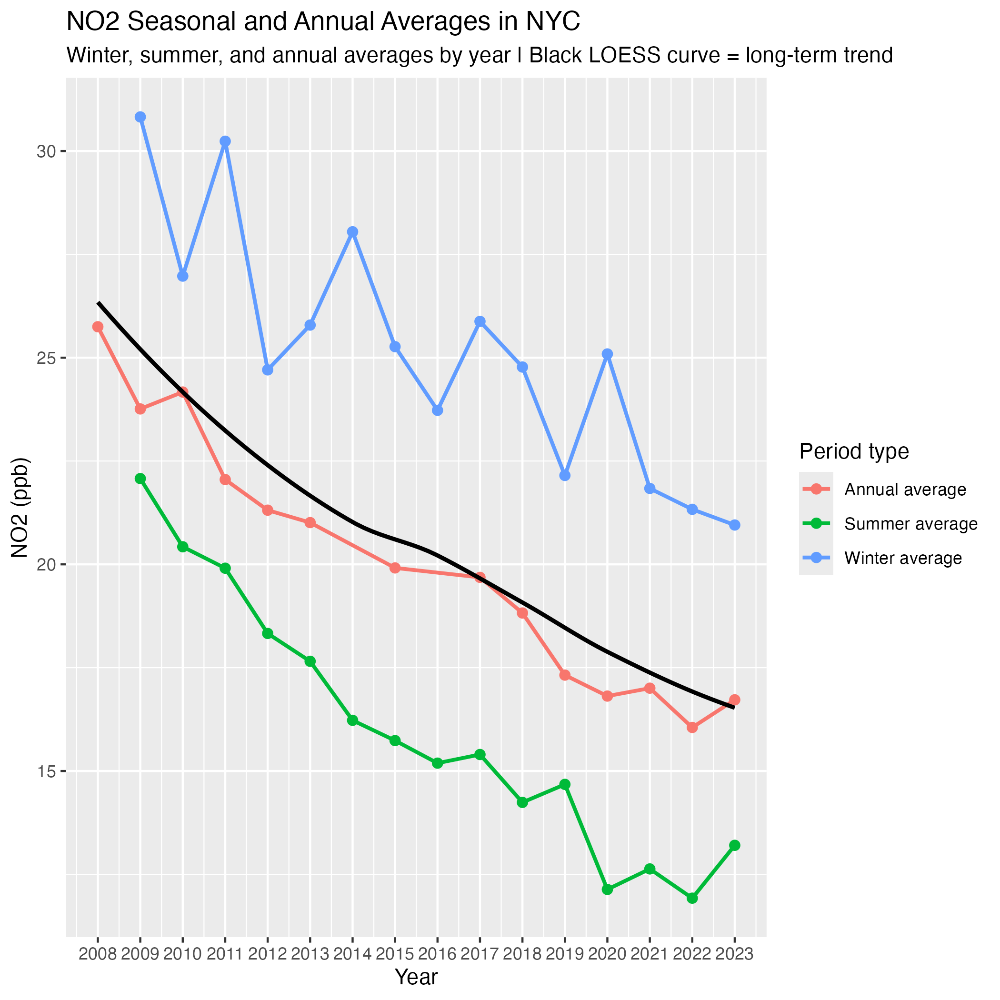
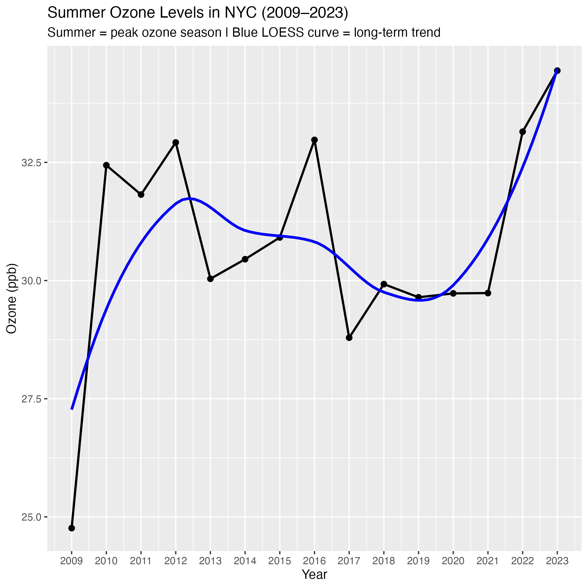
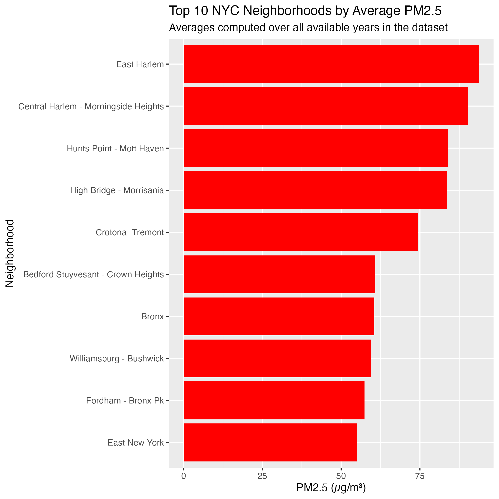
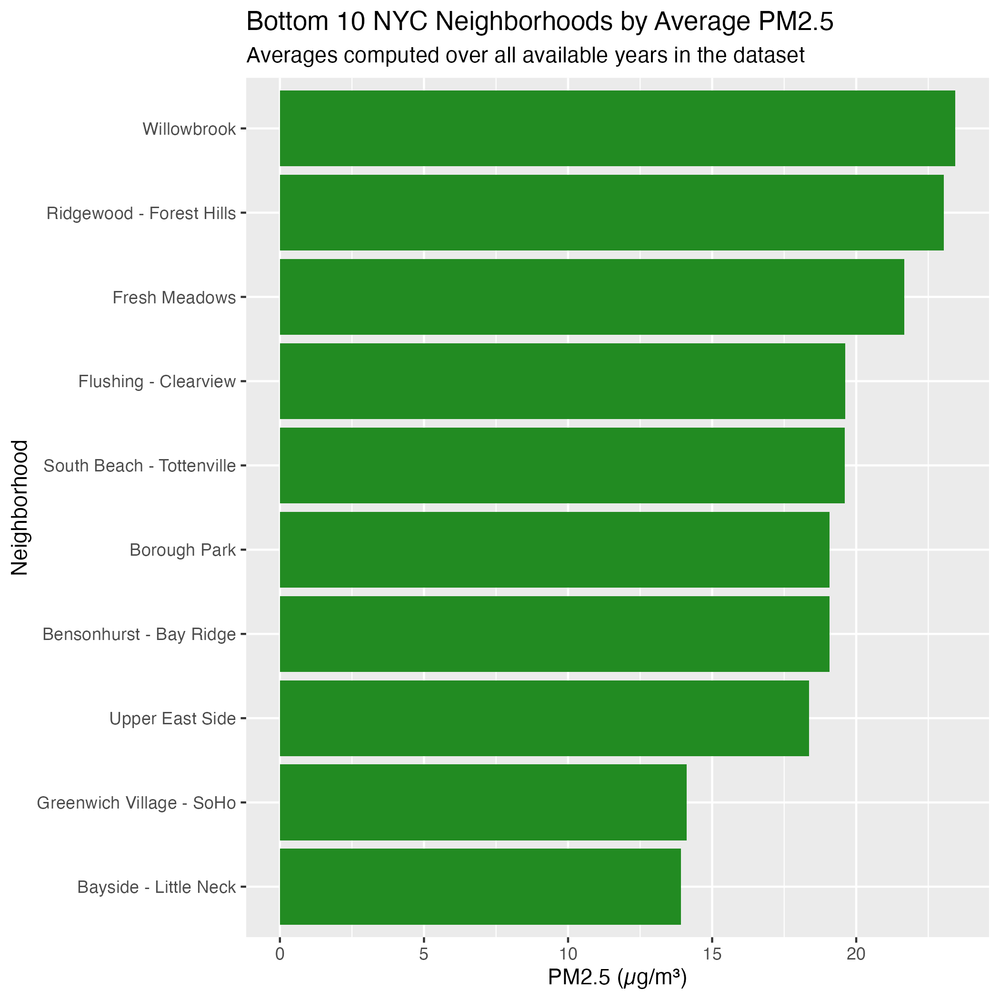
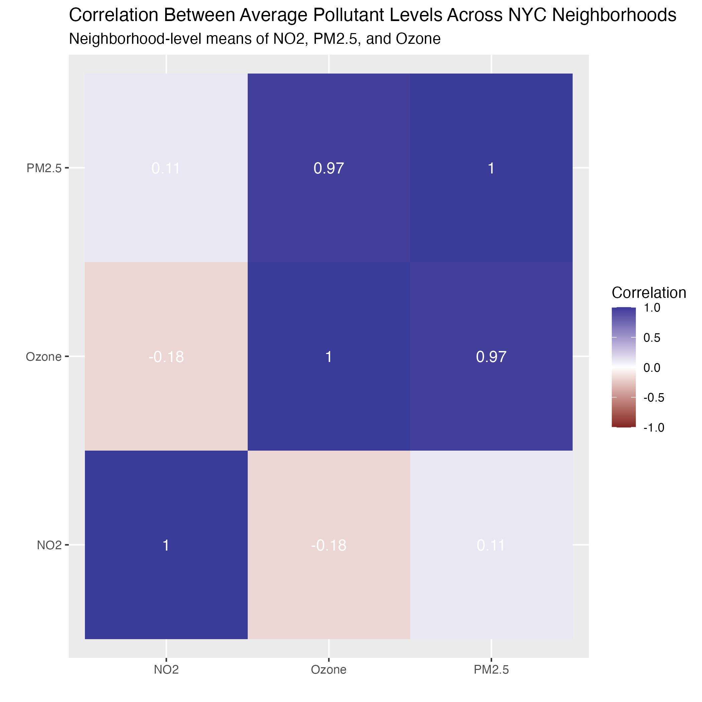
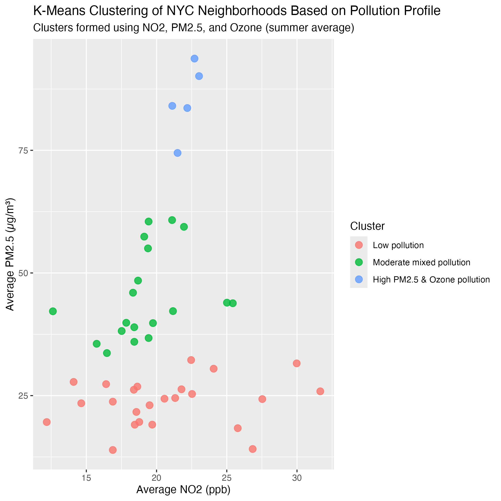
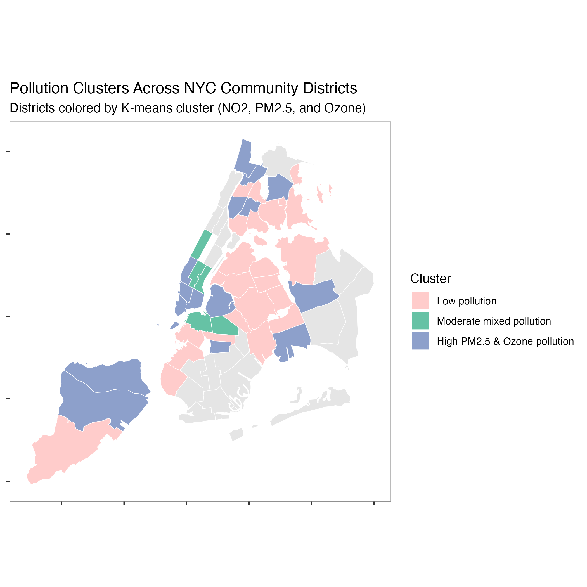

```{r}

knitr::opts_chunk$set(
echo = FALSE,
message = FALSE,
warning = FALSE,
fig.align = "center"
)

library(knitr)

```

# 1. Introduction

Air pollution is a major public health concern in large urban centers, and New York City is no exception. This project uses data from the NYC Department of Health and Mental Hygiene’s Air Quality dataset to explore patterns in three key pollutants:

  - Nitrogen dioxide (NO2) – largely from traffic and combustion sources

  - Fine particulate matter (PM2.5) – tiny particles that penetrate deep into the lungs

  - Ozone (O3) – a secondary pollutant that peaks in warm, sunny months

All data cleaning, aggregation, and modeling are performed in standalone R scripts and orchestrated via a Makefile.

# 2.1 Data Description

The raw data comes from the NYC Air Quality dataset, which includes measurements derived from monitoring and modeling at the community district level. The total row count of this data set is 18862. Key variables used in this project include:

  - start_date: Start date of the time period associated with the measurement

  - time_period: A human-readable time label such as "Summer 2015" or "Annual Average 2017"

  - name: A longer pollutant indicator name (e.g., "Nitrogen dioxide (NO2)" or "Fine particles (PM 2.5)" )

  - measure: The unit of the measurement (e.g., "ppb")

  - data_value: The numerical value of the pollutant indicator

  - geo_place_name: Name of the geographic area (community district)

  - geo_join_id: A code that can correspond to one or more community districts, used for joining to geography files

For this project, I focus on three pollutants: NO2, PM2.5, and Ozone.

Data cleaning steps include:
  - Converting dates to proper Date format
  - Ensuring numeric data types for the pollutant values
  - Dropping rows with missing data_value
  - Restricting to NO2, PM2.5, and Ozone
  
# 2.2 Limitations

NO2 had the most complete and detailed temporal breakdown in the dataset, with annual, summer, and winter averages available for almost every year from 2008–2023. Because this pollutant had sufficient seasonal granularity, I was able to produce a multi-line seasonal time series showing annual, winter, and summer trends, along with a LOESS smoother. The same seasonal detail was not available for PM2.5 or ozone, so NO2 is the only pollutant where seasonal decomposition is possible.

Ozone only had consistently available measurements during the “Summer” period, defined in the Air Quality dataset as the high-ozone season. Although the dataset also contained a “3-year average” version of ozone, the underlying data were incomplete and inconsistent across neighborhoods and years. To avoid plotting misleading or sparsely populated time series, I restricted the ozone trend analysis to summer-only values, which were available every year from 2009–2023. This also reflects how ozone is typically analyzed in environmental health studies, since ozone peaks during summer months and is strongly driven by sunlight and heat.

PM2.5 in the Air Quality dataset was not consistently recorded for the same neighborhoods across all years. Many neighborhoods had only a few years of PM2.5 data, which made it impossible to construct a meaningful annual time series. To avoid misleading gaps or irregular trends, I aggregated PM2.5 to the neighborhood-level mean across all available years. This allowed for stable comparisons of long-term relative burden (top 10 and bottom 10 neighborhoods) without implying nonexistent year-to-year continuity.

For the K-Means Clustering, neighborhood-level averages were used. All three pollutants, NO2, PM2.5, and ozone, had different amounts of missing data depending on neighborhood and year. To fairly compare neighborhoods, I computed each pollutant’s long-term neighborhood average, ensuring that every neighborhood had a single consistent value for clustering. Using neighborhood-level averages prevented the analysis from being biased toward neighborhoods with more frequent measurements and allowed k-means to classify areas based on stable, long-term pollution profiles.

The map has large NA regions because the NYC Air Quality dataset does not include complete pollutant data for all 59 community districts. THis led to some community district to appear in gray (NA) because they did not have sufficient air quality measurements for one or more pollutants in the dataset.

These patterns of missing data are consistent with how NYC's Department of Health collects air monitoring data. NO2 is measured seasonally and annually, ozone is measured seasonally, and PM2.5 is measured for fewer neighborhoods. The analysis is therefore tailored to the actual data coverage and avoids overextending the dataset beyond what it can reliably show.

# 3. NO2 by Periods

```{r fig1, echo = FALSE}



```

This figure shows three time series for NO2 concentration in NYC. It shows the annual average, summer average, and winter average, as well as a black LOESS curve that shows the long-term trend. Across all three metrics, NO2 levels show a clear long-term decline since 2008. This decline is consistent with major policy changes that have aimed to less NO2 pollution. Seasonality is also clearly visible in the graph, hence why summer and winter averages were included in order to not hide important differences. NO2 is highest in the winter because of the need for more heating and atmospheric stagnation while summer is lowest because the opposite is true. 


# 4. Summer Ozone Trends
```{r fig2, echo=FALSE}

```

This figure shows summer only ozone averages, with a LOESS curve showing the smoothed trend. Unlike NO2, ozone does not show a consistent decline but rather fluctuates. Instead the levels increased sharply from 2009 to 2012, stay relatively flat through the late 2010s, before increasing after 2021 and reaching the highest average in 2023. This behavior is expected because ozone is a secondary pollutant and reductions in NO2 can even increase ozone in some regions. Climate warning also tends to drive higher summer ozone peaks.

# 5.1 Top 10 PM2.5 Neighborhoods

```{r fig3a, echo=FALSE}

```

The neighborhoods with the highest 2.5PM have historically higher traffic density, more industrial land use, more bus and truck routes, as well as older residential heating systems.

# 5.2 Bottom 10 PM2.5 Neighborhoods

```{r fig3b, echo=FALSE}

```

The neighborhoods with the lowest 2.5PM are typically suburban, low-density districts with lower traffic volume, fewer commercial highways, more tree coverage and greater distance form industrial corridors.

# 6. Correlations Between Pollutants

```{r fig4, echo=FALSE}

```

The heatmap shows how ozone and PM2.5 have strong positive correlation which suggests that neighborhoods with higher PM2.5 tend to also experience higher ozone. These pollutants can both increase under warm, stagnant air conditions and can be influenced by similar regional atmospheric processes. NO2 shows almost no correlation with both PM2.5 and ozone. The weak correlation because NO2 and ozone is especially expected because high NO can destroy ozone through ozone titration to form NO2 while low NOx areas often exhibit higher ozone levels. But because the values here are neighborhood averages, the relationship averages towards zero.


# 7.1 K-Means Clustering Scatterplot

```{r fig5, echo=FALSE}

```

Through the K-means clustering of neighborhoods by the three pollutants, three meaningful clusters emerge. Cluster 1, which is red, has the lowest pollution, has outer, low-density neighborhoods and has a strong overlap with the bottom 10 PM2.5 list. Cluster 2, which is green, has moderate pollution. Cluster 3, which is blue, has the highest pollution. Clustering on all three pollutants separates neighborhoods into three distinct pollution profiles rather than one smooth gradient.

# 7.2 Mapping Pollution Clusters Across NYC

```{r fig6, echo=FALSE}

```

This map takes the same three clusters and maps them onto NYC community districts. The low pollution cluster covers many central neighborhoods in Queens, along with parts of Staten Island, Brooklyn and the Bronx. The moderate pollution cluster appears mainly in Manhattan and nearby Brooklyn districts. The high pollution cluster includes most of Staten Island, Lower Manhattan as well as parts of the Bronx, Brooklyn and Queens.

Figures 5 and 6 differ in the number of neighborhoods per cluster because the scatter plot uses neighborhood-level observations (NTAs), while the map uses community districts (CDs). These geographies do not correspond 1:1. Many neighborhoods share the same CD, some CDs have missing pollutant data, and some geo_join_ids expand to multiple CD codes. As a result, the high pollution cluster appears in more CD regions on the map than in the scatterplot, while the moderate cluster appears in fewer CDs than expected. This mismatch is expected and arises from the structure of the Air Quality dataset rather than from the clustering algorithm itself.

# Conclusion

This project analyzed three major air pollutants in New York City, NO2, Ozone, and PM2.5, using publicly available data from the NYC Environment and Health Data Portal. Across the analysis it has been shown that NO2 has steadily declined since 2008, while ozone has increased as of late. Meanwhile PM2.5 has insufficient data for trend analysis over time, but neighborhood-level averages show stark spatial inequality. Pollutant correlations revealed that PM2.5 and ozone are strongly correlated, while NO2, in contrast, shows almost no correlation with either pollutant. Clustering analysis identified three consistent pollution profiles, from low pollution, to moderate pollution, and to high pollution. The map visualization also highlighted how neighborhood-level pollution measures do not perfectly align with community district boundaries, causing some clusters to appear more or less geographically represented.

There are several ways this work could be extended. One way would be to build predictive models using machine learning models that could predict pollution prediction based on many different features. These models could identify which features most strongly drive local pollutant levels. Another would be to analyze how neighborhoods have changed over time as some areas have undergone rapid rapid rezoning, redevelopment, or population shifts. It could be interesting to see the effect of gentrification on pollution. The dataset had a lot more indicators so clustering with more features could reveal new cluster types.